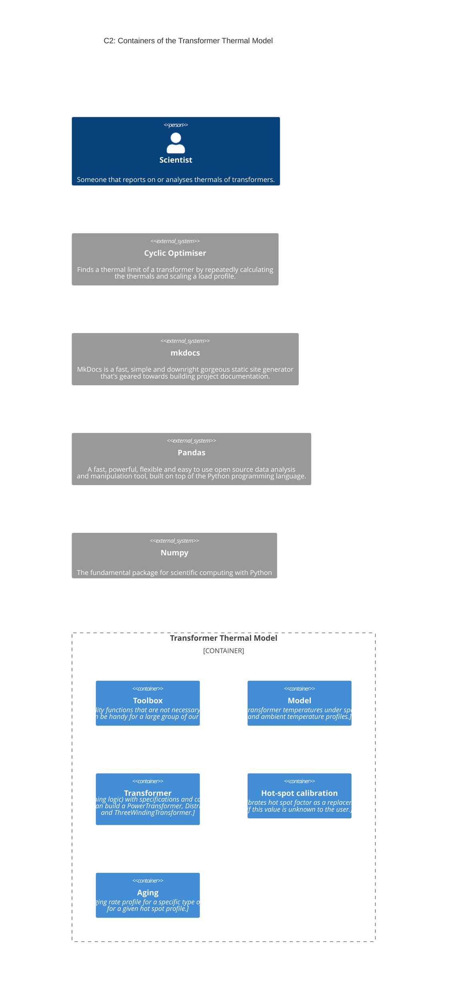

<!--
SPDX-FileCopyrightText: Contributors to the Transformer Thermal Model project

SPDX-License-Identifier: MPL-2.0
-->

# The architecture of Transformer Thermal Model

<!-- markdownlint-disable MD013 -->

<!-- markdownlint-enable MD013 -->
