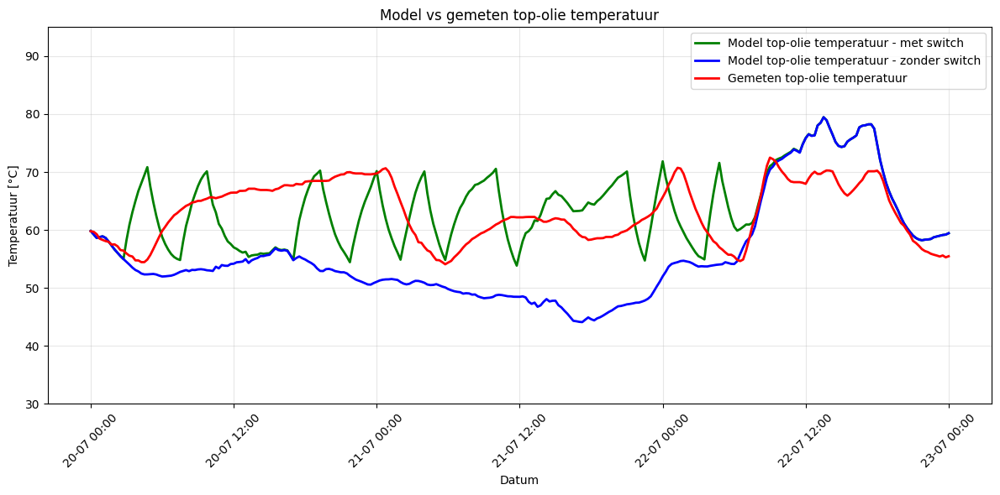

<!--
SPDX-FileCopyrightText: Contributors to the Transformer Thermal Model project

SPDX-License-Identifier: MPL-2.0
-->
# Overview

Power transformers commonly operate in different cooling configurations depending on their thermal loading. Two widely
used modes are:

- ONAN (Oil Natural Air Natural):
Cooling is provided by natural convection of oil and air

- ONAF (Oil Natural Air Forced):
Cooling fans are activated to increase the heat transfer from the radiator surfaces, allowing higher loading before
reaching thermal limits.

Switching between these modes is typically based on temperature thresholds.

## Cooling Mode Switch Feature

Within the transformer model, a switch between ONAN and ONAF situation can be simulated based on either:

- deactivation/activation temperature

- fan-operation schedule, allowing the user to force ONAF operation independently of temperature.

When the switch is triggered, the model updates the cooling parameters to reflect the increased heat-transfer capability
in ONAF. This results in a lower thermal resistance and a faster removal of heat compared to the ONAN state.

## Validation and limitations

The feature was validated using one measurement dataset of a power transformer, with the fan (de)activation temperatures
estimated from the data. From this validation, we concluded that the switch works well on a high level, keeping the
top-oil temperature mostly within the (de)activation temperatures. Some modelled temperature peaks still occurred, but
the measured temperature never exceeded the modelled temperature. On a timestep level, some “ping-pong” behaviour
showed up in the modelled temperatures, which does not appear in the measurements. See the plot below.

So based on our validation, the switch works well to model temperature on a high level, but timestep-level results
should be used with some caution. Also, the switch has not been validated with an inputted fan schedule.
