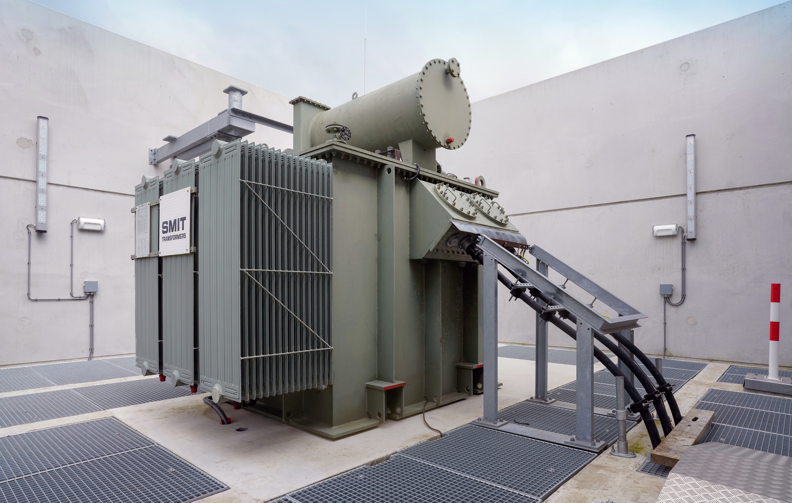

<!--
SPDX-FileCopyrightText: Contributors to the Transformer Thermal Model project

SPDX-License-Identifier: MPL-2.0
-->

# Transformer definition

Transformers connect the grids of different voltage levels and vector groups with each other.
This is achieved by magnetically coupling the windings of different voltage levels. These windings are housed within the
transformer casing, along with a magnetic core, and are shielded with oil and paper mass. This provides both electrical
insulation and thermal conduction for the windings.

{ width="400" }
/// caption
A power transformer surrounded by a concrete blasting wall.
///

Within the term "Transformer," a distinction can be made between power transformers and distribution transformers. Power
transformers form the link between high voltage networks (typically 50 kV and higher) and medium voltage networks
(typically around 10 to 20 kV). The Loading Guide distinguishes between small, medium, and large transformers
(IEC 60076-7, chapter 3). Small (distribution) transformers have a nominal power up to 10 MVA, medium (power)
transformers up to 100 MVA, and large (power) transformers of more than 100 MVA.

Distribution transformers form the link between medium voltage networks and low voltage networks. This type of
transformer is much smaller than power transformers.

Power transformers can be found at substations, where the conversion from high to medium voltage takes place. Typically,
there are around three power transformers per substation that collectively form the link between high voltage and medium
voltage.
